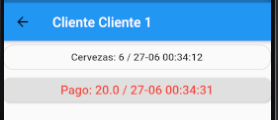

# ChelitaApp

Primer proyecto básico con Flutter, ChelitaApp fue creada para el uso personal en la venta de cervezas, o cualquier bebida. La app te ayudará a tener un control de tus ventas y pagos de tus distintos clientes.

 
## Registro de clientes
  
 La app permite registrar clientes desde su ventana principal(sólo se registra el nombre), cada cliente se muestra con el monto que adeuda en una lista en la ventana principal.
 

## Registro de pagos y pedidos

  Al hacer click sobre un cliente, nos mostrará la lista de pagos y pedidos que ha realizado con su fecha y hora, además, para poder diferenciar entre un pedido y un pago, se mostrará los eventos con distinto color, de ese modo podrá tener control en orden de los pedido y pagos.

 
## Manejo de datos

La app crea una base de datos en el celular, de modo que puede hacer uso de ella sin una conexión a internet.

## Propuestas para la siguiente versión

* Registro de nombre, celular y dirección del cliente
* Poder eliminar/editar un cliente
